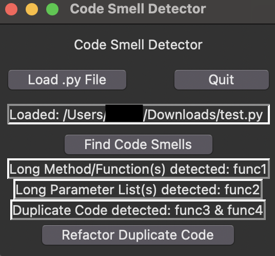

# Code-Smell-Detector
Detects if a .py file has methods/parameter lists that are too verbose or any duplicated code.

### Metrics:
- A method is too verbose if there are 15 or more lines
- A parameter list is too verbose if there are 5 or more parameters
- Duplicated methods are considered duplicates if all the characters' Jaccard similarity scores are 0.75 or above
    - Duplicated methods are able to be refactored (remove one of the duplicates). *NOTE:* Since the similarity is taken by character and not by AST/semantics, refactoring may cause bugs within the code. 

## Usage
```bash
python3 App.py
```

## Example
```python
# test.py
def func1(e,f,g):
    print("hi")
    print("hi")
    print("hi")
    print("hi")
    print("hi")
    print("hi")
    print("hi")
    print("hi")
    print("hi")
    print("hi")
    print("hi")
    print("hi")
    print("hi")
    print("hi")
    print("hi")
    return e,f,g

def func2(a, b, c, d, e, f, g, h):
    return a

def func3(a, b):
    return a * b

def func4(c, d):
    return c * d
```

Once the file is loaded, the GUI will prompt you to detect the code smells, and present them as so:



If the user prompts the GUI to refactor duplicate code, the example should look as so:

```python
# test_refactored.py
def func1(e,f,g):
    print("hi")
    print("hi")
    print("hi")
    print("hi")
    print("hi")
    print("hi")
    print("hi")
    print("hi")
    print("hi")
    print("hi")
    print("hi")
    print("hi")
    print("hi")
    print("hi")
    print("hi")
    return e,f,g

def func2(a, b, c, d, e, f, g, h):
    return a

def func3(a, b):
    return a * b
```

#### This project was built using the following:
